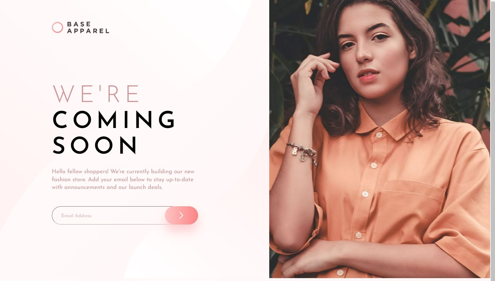

# Frontend Mentor - Base Apparel coming soon page solution

This is a solution to the [Base Apparel coming soon page challenge on Frontend Mentor](https://www.frontendmentor.io/challenges/base-apparel-coming-soon-page-5d46b47f8db8a7063f9331a0). Frontend Mentor challenges help you improve your coding skills by building realistic projects. 

## Overview

### The challenge

Users should be able to:

- View the optimal layout for the site depending on their device's screen size
- See hover states for all interactive elements on the page
- Receive an error message when the `form` is submitted if:
  - The `input` field is empty
  - The email address is not formatted correctly

### Screenshot

### Links

- Live Site URL: (https://peterbujaky.github.io/Frontendmentor---Base-Apparel-Coming-Soon/)

## My process

### Built with

- Semantic HTML5 markup
- CSS custom properties
- SCSS
- Flexbox
- Mobile-first workflow

### What I learned

I learned a great deal of CSS during this challenge, as the description stated there were some interesting details to pay a keen eye to. I have also learned how to use email validation during this challenge.

### Continued development

Improve on time, and writing cleaner code.

## Author

- Frontend Mentor - [@peterbujaky](https://www.frontendmentor.io/profile/peterbujaky)
